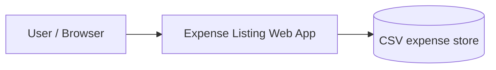
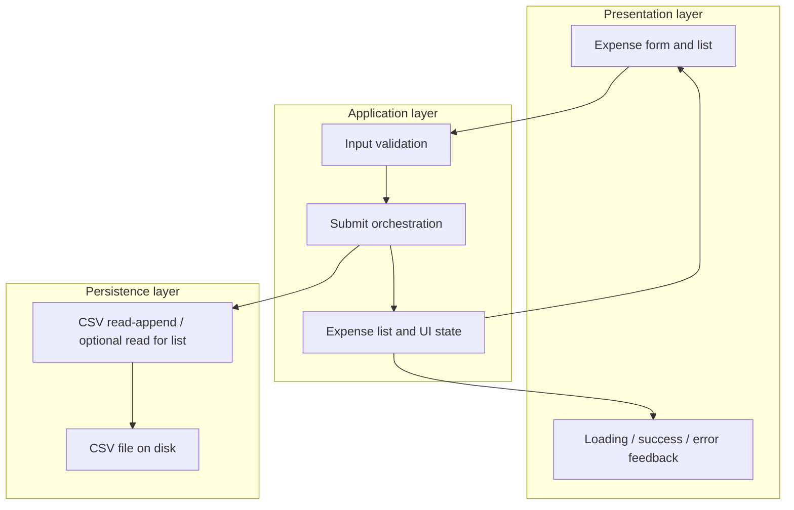
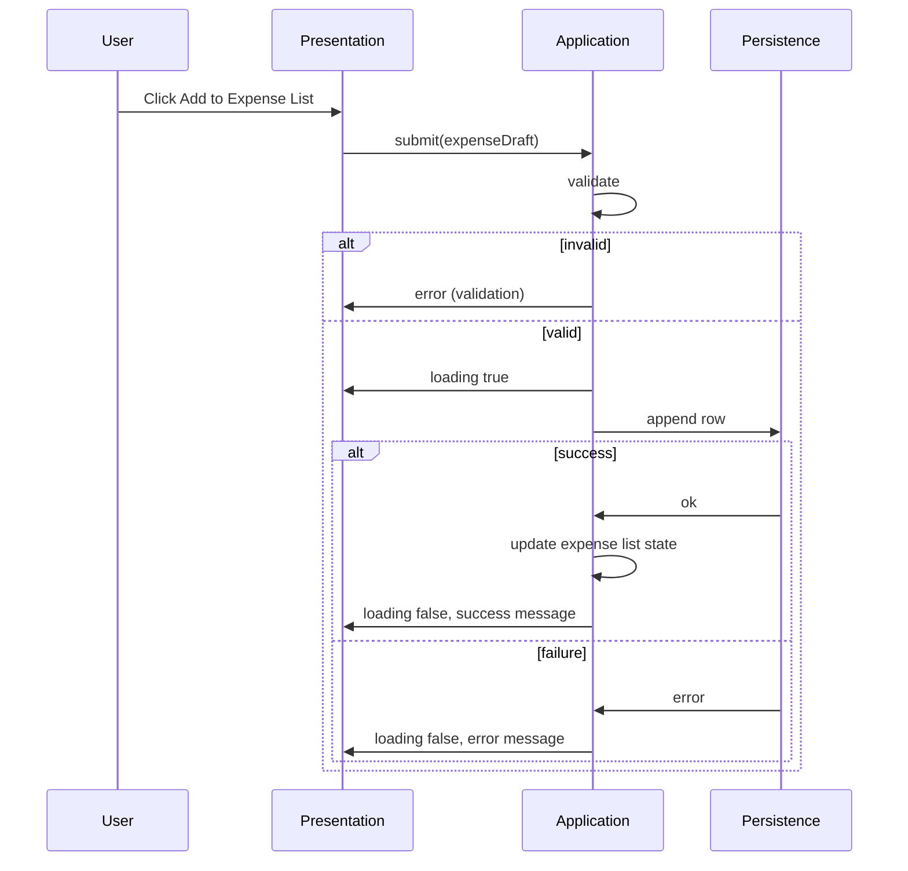

# Expense Listing Web Application — Architecture

This document describes the target system architecture derived from [requirement.md](./requirement.md). It defines structure, responsibilities, data flows, and extension points. **Technical requirements** (chosen stack) are recorded in Section 2.1.

---

## 1. Purpose and scope

The system is a **stateful, data-driven** web application that lets a user capture expenses (item, amount, category, date), validate input, persist rows in **CSV** format, and receive **asynchronous** UI feedback (loading, success, error). Scope matches the functional and non-functional requirements in Section 2–5 of the requirements document.

---

## 2. Architectural principles

| Principle | Rationale (requirements trace) |
|-----------|--------------------------------|
| **Separation of concerns** | Form/validation, persistence, and UI feedback are distinct responsibilities (4.1, 4.2, 4.3, 4.4). |
| **Single source of truth for persisted data** | CSV is the durable store; in-memory or client state reflects it after successful writes (4.2, 4.4). |
| **Non-blocking submission** | Add action must not reload the page; user sees spinner then success or error (4.3). |
| **Explicit validation boundary** | Mandatory fields, numeric amount, and valid date are enforced before or at save (4.1). |
| **Low-concurrency design** | Single-user or low concurrency assumed; CSV access can be simplified accordingly (Section 7). |

### 2.1 Technical requirements

The implementation targets the following stack:

| Area | Technology |
|------|------------|
| **Runtime** | Node.js |
| **HTTP / application server** | Express |
| **User interface** | Plain **HTML**, **CSS**, and **JavaScript** (no SPA framework required) |
| **Async submission** | Browser `fetch` (or equivalent) to Express JSON routes; DOM updates for spinner, success, and error states |
| **Persistence** | CSV read/write from Express only (client does not write the file directly) |

Express serves static assets (e.g. `public/`) and exposes API routes (e.g. `POST` / `GET` for expenses) that enforce validation and call the CSV persistence adapter.

---

## 3. System context

- **User**: Enters expenses and reads feedback only through the web UI.
- **Web application**: Hosts the UI, applies validation, orchestrates append to CSV (directly or via a small backend), manages transient UI state.
- **CSV**: Authoritative tabular persistence for all saved expense rows.

Whether CSV is written from a **server-side** component (recommended for consistency and security) or from a **client-only** prototype is an implementation choice; the architecture below assumes a **thin persistence API** in front of the file so read/write rules stay centralized.

---

## 4. Logical architecture

### 4.1 Layers

| Layer | Responsibility |
|--------|----------------|
| **Presentation** | Renders fields (item, amount, category, date), submit control, list of expenses, and feedback affordances (spinner, messages). |
| **Application** | Validates input, coordinates async submit, updates in-memory state (expense list, loading/success/error), maps server/file errors to user-visible messages. |
| **Persistence** | Appends one row per successful save; enforces column order and encoding; optionally reads full file or tail for list refresh (efficiency per 5.2). |

### 4.2 Major components

1. **Expense capture UI** — Binds to application state; triggers validation and submit (3, 4.1, 4.3).
2. **Validation module** — Rules: non-empty mandatory fields, numeric amount, valid date (4.1).
3. **Submit handler** — Async path: set loading → call persistence → on success append to local expense state and show success; on failure show error (4.3, 4.4).
4. **CSV persistence adapter** — Encapsulates path, header row, escaping, and append semantics; isolates future swap to a database (5.3).
5. **Category source** — Predefined set (Shopping, Travel, Food, Others) with a clear extension point (configuration or code constant) (3, 5.3).

---

## 5. Data architecture

### 5.1 Canonical CSV schema

Each row is one expense. Column order is fixed for interoperability and simple parsing:

| Column | Type / constraint | Notes |
|--------|-------------------|--------|
| `Item` | Non-empty string | User description (3). |
| `Amount` | Numeric | Stored in a consistent decimal representation (4.1). |
| `Category` | Enum of allowed values | Extendable list (3, 5.3). |
| `Date` | ISO 8601 date (recommended) or locale-consistent format | Must round-trip as “valid date” in UI (4.1). |

Header row present on file creation; subsequent writes append data rows only.

### 5.2 File and concurrency

- **Location**: Configurable path (environment or app config); documented for operators.
- **Concurrency**: Under low concurrency, **append with file lock** or equivalent avoids interleaved writes; if multiple writers appear later, move to DB or queue (5.3, Section 7).

---

## 6. State model

### 6.1 Client / session state (4.4)

| State | Description |
|-------|-------------|
| **Form draft** | Current field values before successful submit (optional reset after success). |
| **Expense list** | Ordered collection of saved expenses shown in the UI; updated after successful append (and optionally reloaded from CSV for consistency). |
| **Submission** | `idle` \| `loading` \| `success` \| `error` — drives spinner and messages (4.3). |
| **Last error** | User-safe message for failed validation or persistence (4.3). |

### 6.2 Server-side state (if applicable)

If a backend serves the UI and CSV:

- **Stateless HTTP** between requests is sufficient; durable state lives in CSV only.
- Optional **in-memory cache** of parsed rows is a performance optimization, not required by requirements.

---

## 7. Key runtime flows

### 7.1 Add expense (async, no full page reload)

- **Validation failure**: No CSV write; no loading spinner required beyond optional instant feedback (implementation detail).
- **Success**: Spinner dismissed, success message shown, new row reflected in list state (4.3, 4.4).

---

## 8. Cross-cutting concerns

| Concern | Approach |
|---------|----------|
| **UX (5.1)** | Responsive layout; visible loading, success, and error states tied to submission state machine (4.3). |
| **Performance (5.2)** | Async I/O; avoid reading entire CSV on every keystroke; batch or debounce if search/filter is added later. |
| **Scalability / evolution (5.3)** | Categories as data or config; persistence behind an interface so CSV can be replaced by a database without changing the UI contract. |
| **Security** | Not detailed in requirements; for any server that writes CSV, validate and sanitize inputs and restrict file path access. |

---

## 9. Extension hooks (future enhancements)

Maps to Section 6 of the requirements:

| Enhancement | Architectural note |
|-------------|---------------------|
| Edit / delete | Replace append-only adapter with row identity (e.g. stable ID column) and read-modify-write or DB transactions. |
| Filter by category / date | Query layer over loaded rows or indexed store; keep CSV adapter or migrate to DB. |
| Export | Additional output formatter (same domain model). |
| Dashboard / analytics | Read path aggregating amounts by category/date from the same domain model. |

---

## 10. Traceability

| Requirement area | Architecture anchor |
|------------------|---------------------|
| 3 Core use cases | Sections 4.2, 5.1 |
| 4.1 Validation | Sections 4.2, 7.1 |
| 4.2 CSV storage | Sections 3, 5 |
| 4.3 Async submission + feedback | Sections 4.2, 6.1, 7.1 |
| 4.4 State | Section 6 |
| 5 NFRs | Section 8 |
| 6 Future | Section 9 |
| 7 Assumptions | Section 5.2 |
| Technical stack | Section 2.1 |

---

## 11. Open decisions (implementation phase)

1. **Monolith vs static UI + API**: Single deployable (Express serves `public/` + API) vs separate static host and Express-only API for CSV append.
2. **List population**: Full CSV read on load vs incremental append to client state only.

**Stack** is fixed per **Section 2.1** (Express + plain HTML/CSS/JS). Remaining choices above do not alter the logical architecture in Sections 4–7; they affect deployment and data-loading behavior only.
